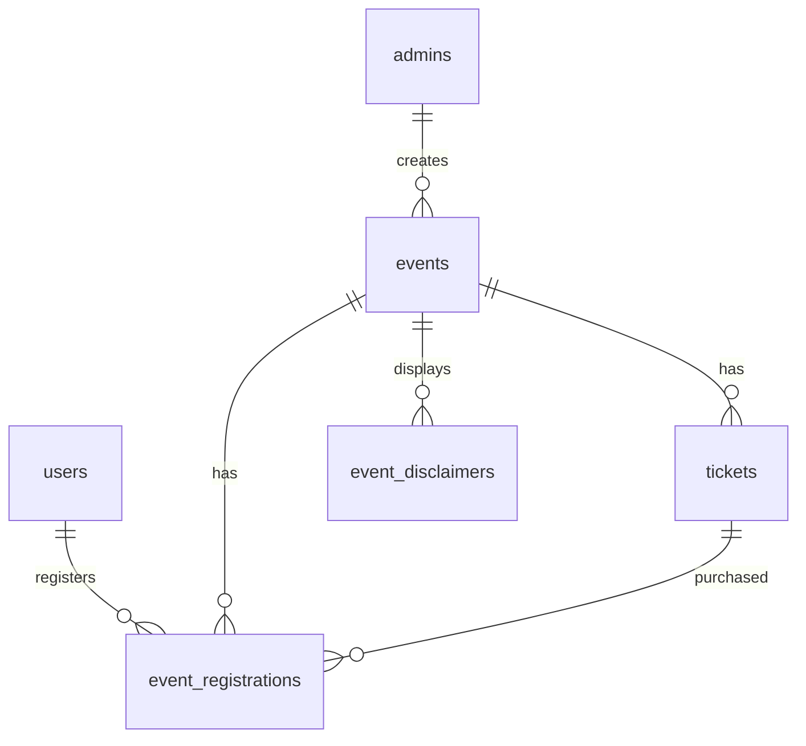

# Event Ticket System Architecture and Database Schema

## Overview
This document outlines the design for an event ticket system integrated into the News Marketplace project. The system supports event creation, ticket management, user registrations with custom forms, and admin oversight.

## Database Schema

### Events Table
```sql
CREATE TABLE IF NOT EXISTS events (
    id SERIAL PRIMARY KEY,
    title VARCHAR(255) NOT NULL,
    description TEXT,
    country VARCHAR(100),
    city VARCHAR(100),
    start_date DATE,
    end_date DATE,
    month VARCHAR(20), -- Derived from start_date, for filtering
    event_type VARCHAR(50) CHECK (event_type IN ('Government Summit', 'Power List', 'Membership', 'Leisure Events', 'Sports Events', 'Music Festival', 'Art Festival')),
    is_free BOOLEAN DEFAULT FALSE,
    organizer VARCHAR(255),
    venue VARCHAR(255),
    capacity INTEGER,
    registration_deadline DATE,
    status VARCHAR(20) DEFAULT 'active' CHECK (status IN ('active', 'cancelled', 'completed')),
    custom_form_fields JSONB, -- For additional registration fields like Forbes Billionaire List
    disclaimer_text TEXT, -- For ticker or page disclaimer
    created_by INTEGER REFERENCES admins(id),
    created_at TIMESTAMP DEFAULT CURRENT_TIMESTAMP,
    updated_at TIMESTAMP DEFAULT CURRENT_TIMESTAMP
);

-- Indexes
CREATE INDEX idx_events_country ON events(country);
CREATE INDEX idx_events_city ON events(city);
CREATE INDEX idx_events_month ON events(month);
CREATE INDEX idx_events_event_type ON events(event_type);
CREATE INDEX idx_events_status ON events(status);
CREATE INDEX idx_events_start_date ON events(start_date);
```

### Tickets Table
```sql
CREATE TABLE IF NOT EXISTS tickets (
    id SERIAL PRIMARY KEY,
    event_id INTEGER NOT NULL REFERENCES events(id) ON DELETE CASCADE,
    name VARCHAR(100) NOT NULL, -- e.g., 'Early Bird', 'VIP'
    description TEXT,
    price DECIMAL(10,2) DEFAULT 0.00,
    quantity_available INTEGER,
    max_per_user INTEGER DEFAULT 1,
    sale_start_date TIMESTAMP,
    sale_end_date TIMESTAMP,
    status VARCHAR(20) DEFAULT 'active' CHECK (status IN ('active', 'sold_out', 'cancelled')),
    created_at TIMESTAMP DEFAULT CURRENT_TIMESTAMP,
    updated_at TIMESTAMP DEFAULT CURRENT_TIMESTAMP
);

-- Indexes
CREATE INDEX idx_tickets_event_id ON tickets(event_id);
CREATE INDEX idx_tickets_status ON tickets(status);
```

### Event Registrations Table
```sql
CREATE TABLE IF NOT EXISTS event_registrations (
    id SERIAL PRIMARY KEY,
    event_id INTEGER NOT NULL REFERENCES events(id) ON DELETE CASCADE,
    user_id INTEGER REFERENCES users(id), -- Nullable for anonymous registrations
    ticket_id INTEGER REFERENCES tickets(id),
    registration_data JSONB, -- Stores custom form responses
    status VARCHAR(20) DEFAULT 'pending' CHECK (status IN ('pending', 'confirmed', 'cancelled', 'attended')),
    payment_status VARCHAR(20) DEFAULT 'unpaid' CHECK (payment_status IN ('unpaid', 'paid', 'refunded')),
    payment_amount DECIMAL(10,2),
    registration_date TIMESTAMP DEFAULT CURRENT_TIMESTAMP,
    updated_at TIMESTAMP DEFAULT CURRENT_TIMESTAMP
);

-- Indexes
CREATE INDEX idx_event_registrations_event_id ON event_registrations(event_id);
CREATE INDEX idx_event_registrations_user_id ON event_registrations(user_id);
CREATE INDEX idx_event_registrations_status ON event_registrations(status);
CREATE INDEX idx_event_registrations_payment_status ON event_registrations(payment_status);
```

### Disclaimers Table (for ticker)
```sql
CREATE TABLE IF NOT EXISTS event_disclaimers (
    id SERIAL PRIMARY KEY,
    event_id INTEGER REFERENCES events(id) ON DELETE CASCADE,
    message TEXT NOT NULL,
    is_active BOOLEAN DEFAULT TRUE,
    display_order INTEGER DEFAULT 0,
    created_at TIMESTAMP DEFAULT CURRENT_TIMESTAMP,
    updated_at TIMESTAMP DEFAULT CURRENT_TIMESTAMP
);

-- Indexes
CREATE INDEX idx_event_disclaimers_event_id ON event_disclaimers(event_id);
CREATE INDEX idx_event_disclaimers_is_active ON event_disclaimers(is_active);
```

## ER Diagram



## API Endpoints Outline

### Events
- GET /api/events - List events with filters (country, city, month, event_type, paid/free)
- GET /api/events/:id - Get event details
- POST /api/events - Create event (admin only)
- PUT /api/events/:id - Update event (admin only)
- DELETE /api/events/:id - Delete event (admin only)

### Tickets
- GET /api/events/:eventId/tickets - List tickets for event
- POST /api/events/:eventId/tickets - Create ticket (admin only)
- PUT /api/tickets/:id - Update ticket (admin only)
- DELETE /api/tickets/:id - Delete ticket (admin only)

### Registrations
- GET /api/events/:eventId/registrations - List registrations (admin only)
- POST /api/events/:eventId/register - Register for event
- GET /api/registrations/:id - Get registration details (user/admin)
- PUT /api/registrations/:id - Update registration (user/admin)
- DELETE /api/registrations/:id - Cancel registration

### Disclaimers
- GET /api/events/:eventId/disclaimers - Get active disclaimers
- POST /api/events/:eventId/disclaimers - Create disclaimer (admin)
- PUT /api/disclaimers/:id - Update disclaimer (admin)
- DELETE /api/disclaimers/:id - Delete disclaimer (admin)

## User Roles and Permissions
- **Users**: Can view events, register, manage their registrations
- **Admins**: Full CRUD on events, tickets, registrations, disclaimers

## Frontend Considerations
- Event listing page with filters (country, city, month, type, paid/free)
- Event detail page with ticket selection and registration form
- Dynamic form fields based on event.custom_form_fields
- Disclaimer ticker component
- Admin dashboard for managing events

## Additional Features
- Payment integration for paid events
- Email notifications for registrations
- QR code generation for check-in
- Analytics dashboard for admins